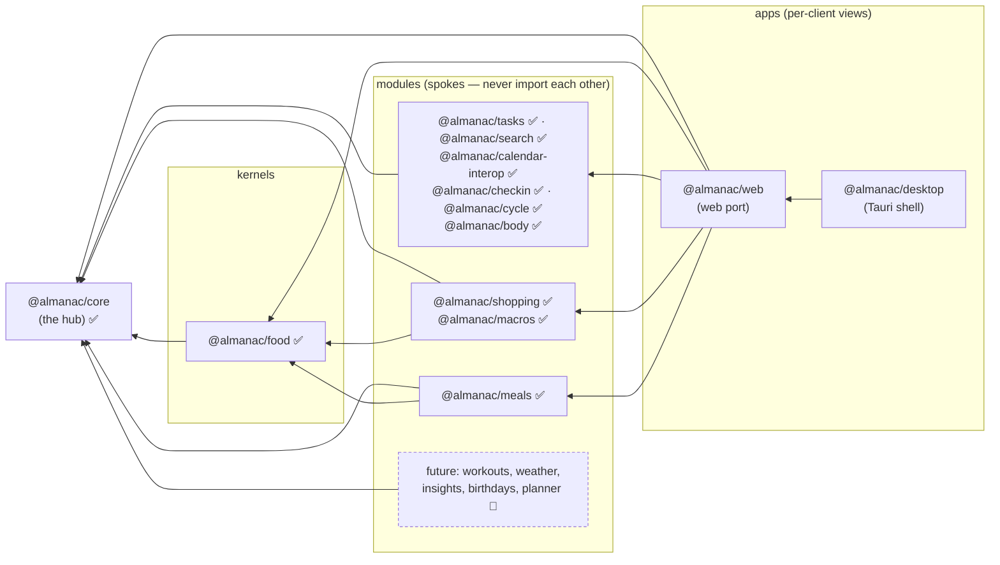
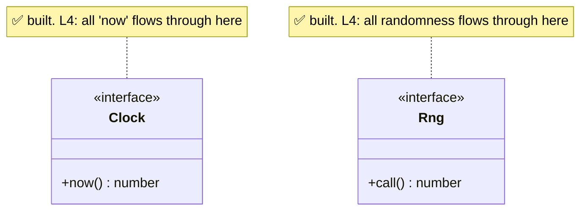
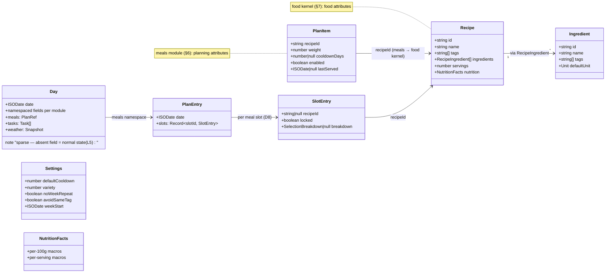
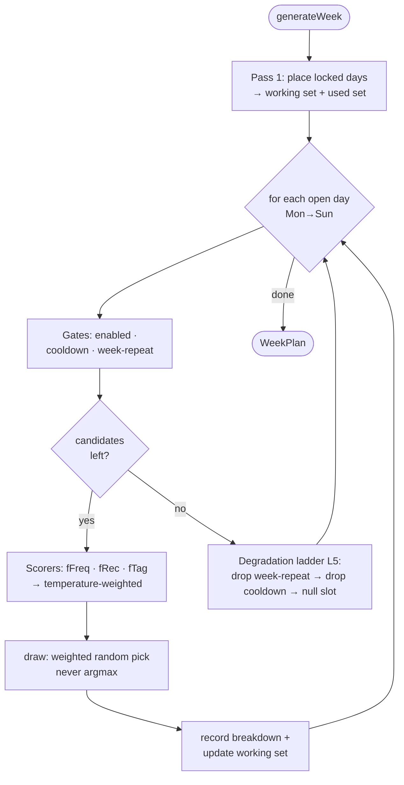

# Architecture

How Almanac is put together, and the laws that keep it that way. Diagrams are
[Mermaid](https://mermaid.js.org/) (GitHub renders them inline).

> **Legend for "built vs planned":** ✅ implemented today · 🔵 specified contract,
> not yet coded. As of Phase 9 (2026-07-11) the core, kernel, nine modules, and
> both clients are ✅; the remaining 🔵 are the outstanding P9 modules and
> P10–P12 (sync, mobile, multi-user).

## The laws

Non-negotiable; enforced where possible (design doc §2).

- **L1 — Star modularity.** A module imports **core + kernels only, never another
  module.** Shared needs move *down*, never sideways. Enforced by the ESLint
  `boundaries` rule — a sibling import is a failed build.
- **L2 — Composition over inheritance.** No class hierarchies; rules/scorers/
  providers are plain functions or registered objects.
- **L3 — Pure, framework-agnostic core.** Core + module logic are plain TS, zero
  UI-framework deps. Dependencies point inward only.
- **L4 — Determinism by injection.** Randomness via an injected `Rng`, "now" via
  an injected `Clock`. No `Math.random()`/`Date.now()` in logic.
- **L5 — Graceful degradation, everywhere.** Every component has a defined, quiet,
  lower-capability state for missing/partial/erroring input. Failures isolate.
- **L6 — Locally-cached, server-durable (relaxed, D4).** On-device store for
  instant UI + offline; opt-in sync makes the server copy durable (per-slice
  LWW by revision).
- **L7 — i18n from day one.** No hardcoded strings; missing key → English.
- **L8 — Strict TypeScript.** `strict` + `noUncheckedIndexedAccess`; no `any`.

## Dependency star (component view)

Arrows read **"depends on"** and point strictly inward. This is the shape L1/L3
guarantee and the boundary lint enforces.

Shopping and macros read the planned meals off the **shared day record by
namespace** — the L1 seam — which is why neither imports the meals module.

**Boundary matrix (lint-enforced):**

| Element | May import |
|---|---|
| `core` | nothing but itself |
| `kernels/*` | `core` |
| `modules/*` | `core`, `kernels/*` — **never another module** |
| `apps/*` | `core`, `kernels/*`, `modules/*` |

## Core ports (built) — the L4/L6 seams

Ports keep the core pure and testable; adapters live in kernels/apps.

Also built: **`StoragePort`** (read/write/remove/keys + optional batched
`readMany`; adapters: memory, localStorage, SQLite via Tauri, all passing one
contract suite), **`SyncPort`** (batch push / pull-since-revision per D4, no
server yet), **`NotificationPort`** (Tauri + Web Notifications adapters),
**`FeedPort`** (ICS subscriptions), **`NutritionPort`** (Open Food Facts
adapter with caching), and the **`WeatherPort`** contract (its adapter lands
with the P9 weather module).

## Domain model (✅ built — Phases 3–4, generalized by D8)

The core + first module, per design doc §5 (day record), §6 (meal engine), §7
(food kernel). One shape has since changed deliberately: **D8** generalized a
plan entry from one meal per day to one per **cell** (day × configurable meal
slot) — `PlanEntry.slots: Record<slotId, SlotEntry>`, each slot carrying its
own `recipeId`/`locked`/`breakdown`.

**Key seam:** a meal's *food* attributes live in the **food kernel** (`Recipe`);
its *planning* attributes live in the **meals module** (`PlanItem`), linked by
`recipeId`. That's why macros/shopping can reuse recipes without importing meals.

## Meal engine flow (✅ Phase 4; per-cell since D8)

The one fully-specified algorithm (design doc §6), implemented exactly and
guarded by seeded statistical tests (§12). Since D8 the loop below runs per
**cell** (day × meal slot, day-major) with cooldown/week-repeat/tag history
shared across all cells. Sketch of `generateWeek`:

Determinism note (L4): identical state + different `Rng` seed ⇒ different weeks;
that's the anti-clustering property the statistical tests guard (design §12).

## What's actually built today (Phases 0–8 ✅, Phase 9 🔨)

- **Core (P1, extended P5)** ✅ — time + timed/multi-day timezone-aware spans,
  seeded RNG, units, recurrence v2 (yearly, nth-weekday, exDates, per-instance
  overrides, series split), sparse Day record + `DayStore` with isolated
  versioned slice codecs and batched range reads, calendar model (grids,
  unbounded priority intensity per D9), signal registry, i18n service, and the
  port contracts above.
- **Food kernel (P3)** ✅ — ingredients/recipes/derived nutrition, catalog,
  OFF adapter with caching + quiet offline degradation.
- **Meals (P4, D8)** ✅ — the §6 engine per cell with configurable slots,
  lock/re-roll, variety temperature, "why this pick" breakdowns, statistical
  anti-pattern suite.
- **Tasks (P6)** ✅ — tasks/events/habits as tombstoned entity records (D6/D7),
  NL quick entry (EN+CS), categories/locations/priority sigils, multiple
  calendars, reminders over `NotificationPort`, ⌘K palette.
- **Shopping + Macros (P7)** ✅ — two-trigger aggregation windows; on-read
  intake derivation + targets. Neither imports meals (shared-record seam).
- **Interop & findability (P8)** ✅ — own minimal RFC 5545 parse/serialize,
  ICS import/export, read-only feed subscriptions with stale-cache degradation,
  ranked search in the palette, year density view, print stylesheet.
- **Life modules (P9, in progress)** 🔨 — check-in ✅, cycle (median stats,
  informational phase/fertile estimates, LH-test anchoring) ✅, body & weight
  trend ✅; workouts, weather, insights, birthdays, planner 🔵. Per-module
  show/hide setting ✅.
- **Clients** ✅ — the shared React renderer (web port) and the Tauri v2
  desktop shell with a SQLite `StoragePort`; vault export/import as the
  pre-sync durability story. ~390 tests across node + jsdom projects.

Phase-by-phase narrative: [BUILD_JOURNAL.md](BUILD_JOURNAL.md) · sequence:
[ROADMAP.md](ROADMAP.md).
